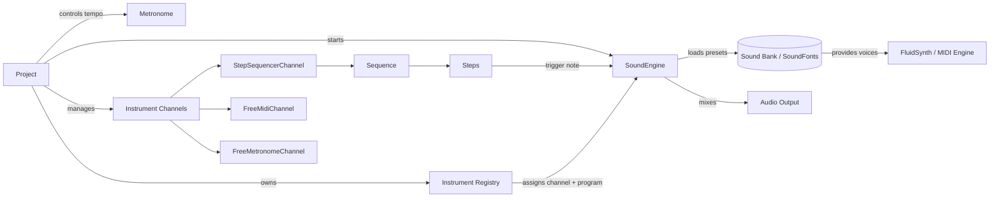

# loopy

Python based MIDI sequencer and looper.

## Installation

Loopy needs FluidSynth and a General MIDI soundfont. Keep the instructions
below short and sweet:

### Linux (Ubuntu / Debian)

```bash
sudo apt update
sudo apt install fluidsynth alsa-utils libasound2-dev libpulse-dev libsdl2-dev
```

Then install the Python package:

```bash
uv sync
# or
pip install -e .
```

### Windows 10/11

1. Install FluidSynth from [the official releases](https://github.com/FluidSynth/fluidsynth/releases)
   or via `winget install FluidSynth.FluidSynth`, and make sure `fluidsynth.exe`
   is on your `PATH`.
2. Install Python dependencies with `uv sync` or `pip install -e .` from a
   terminal in the project directory.

### Soundfonts

Grab any General MIDI `.sf2` file (for example the
[GeneralUser GS soundfont](https://schristiancollins.com/generaluser.php)) and
point Loopy to its path. The repository includes
`sf2/GeneralUser-GS2-Presets.txt` if you want a quick reference for patch
numbers.

## Architecture overview



## Running with uv

Loopy now exposes a console script entry point, so you can launch it directly
with `uv run`:

```bash
uv run loopy
```

All of the CLI flags continue to work and can be passed without the additional
`python -m` invocation:

```bash
uv run loopy --theme lofi-chill
uv run loopy --list-themes
```

> [!NOTE]
> On Linux you need the ALSA development headers so that the optional
> `pyalsaaudio` dependency can compile. Install them before running `uv run`:
>
> ```bash
> sudo apt-get install libasound2-dev
> ```

## Interface themes

Loopy now supports selectable colour themes for its curses interface. Run the
application with the `--theme` flag to pick the LoFi chilly look or fall back to
the classic console palette:

```bash
python loopy.py --theme lofi-chill
```

To see the available themes and their descriptions, use:

```bash
python loopy.py --list-themes
```
