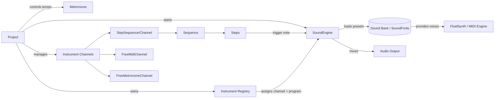

# loopy

Python based MIDI sequencer and looper.

## Architecture overview



## Interface themes

Loopy now supports selectable colour themes for its curses interface. Run the
application with the `--theme` flag to pick the LoFi chilly look or fall back to
the classic console palette:

```bash
python loopy.py --theme lofi-chill
```

To see the available themes and their descriptions, use:

```bash
python loopy.py --list-themes
```
